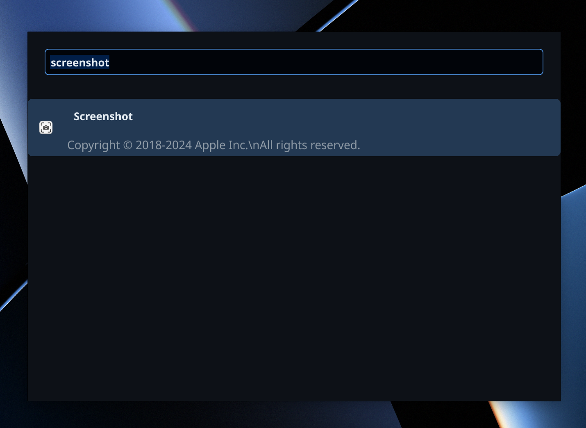

# Marvin - A Spotlight Alternative

Marvin is a lightweight Spotlight alternative built with Go and Fyne.io. It provides quick search functionality for files, folders, and applications on your system using macOS Spotlight index.



## Features

- Fast searching using macOS Spotlight index
- Global hotkey activation (Cmd+Space)
- File/application launching
- Lightweight and responsive

## Requirements

- Go 1.18 or higher
- macOS (due to dependency on macOS Spotlight and current window management)
- Fyne.io dependencies (automatically installed via Go modules)

## Installation

### Quick Build

```bash
# Clone the repository
git clone https://github.com/MordFustang21/marvin.git

# Build and install
cd marvin
go build -o marvin ./cmd/marvin
```

### Build macOS App Bundle

For a proper macOS application bundle with app icon and proper integration:

```bash
# Clone the repository
git clone https://github.com/MordFustang21/marvin.git
cd marvin

# Run the build script
./build/build_macos.sh
```

This will create a `Marvin.app` bundle in the `build/` directory that you can copy to your Applications folder. The build script:

- Creates a proper macOS app bundle structure
- Includes the application icon (if available)
- Sets up the Info.plist with proper metadata
- Configures the app to run as a background utility (LSUIElement)
- Makes the app ready for distribution

**Note**: After installation, if you receive a security warning when first launching, go to System Preferences > Security & Privacy and click "Open Anyway".

## Usage

Run the application:

```bash
./marvin
```

Press `Cmd+Space` (or `Alt+Space`) to activate the search interface. Type your search query to find files, folders, and applications.

## Configuration

Currently, Marvin has minimal configuration options. Future versions will include:

- Customizable themes
- Configurable keyboard shortcuts
- Plugin system for extended functionality

## Architecture

Marvin is built using the following components:

- **UI Layer**: Uses Fyne.io for cross-platform GUI however only macOS is supported at the moment.
- **Search Layer**: Is a registry of various providers that can provide various search/autocomplete results. [Detailed documentation](internal/search/README.md).

## Contributing

Contributions are welcome! Please feel free to submit a Pull Request.

### Creating New Search Providers

Marvin's search functionality is extensible through search providers. See the [search architecture documentation](internal/search/README.md) for details on implementing custom providers.

## TODO
- [] Improve performance and responsiveness.
  - Optimize search algorithms.
  - Implement caching for frequently accessed files.
  - Track search history to improve results.
- [] Implement themeing
  - Allow users to customize the appearance of the application.
  - Provide a set of pre-defined themes.
- [] Implement settings
  - Allow users to configure keyboard shortcuts.
  - Provide options for enabling/disabling specific search providers.
  - Allow users to set custom ordering of providers?

## License

This project is licensed under the MIT License - see the [LICENSE](LICENSE.md) file for details.
